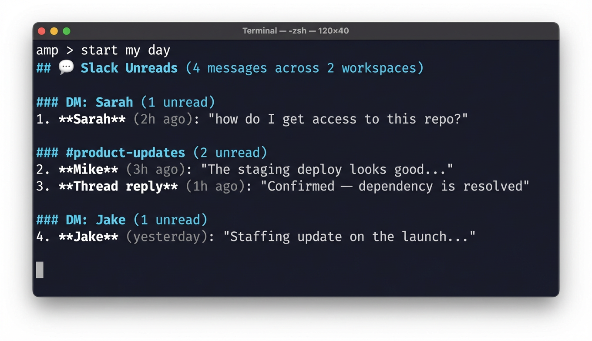
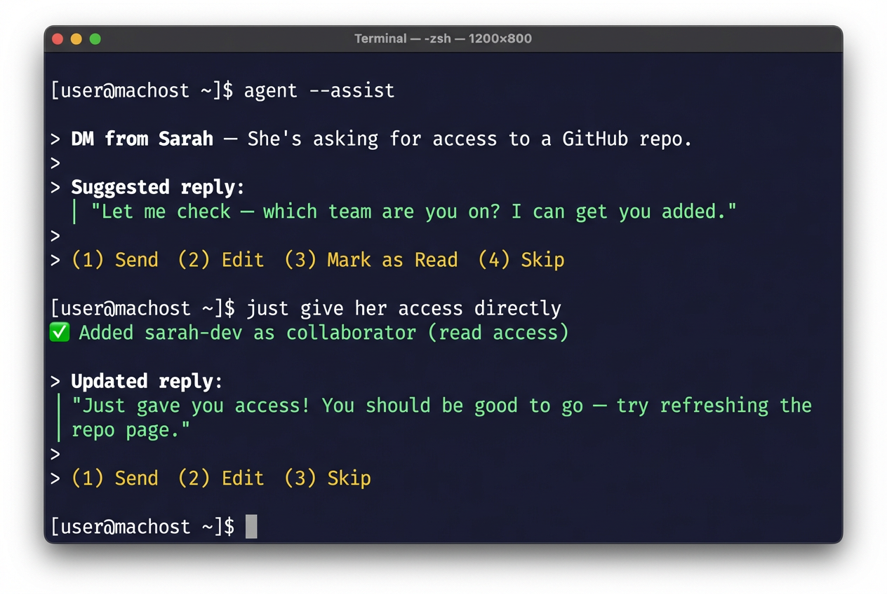

| | title | date | author | tags |
|---|---|---|---|---|
| | I Replaced My Morning Routine with a Single Command | 2026-03-05 | Abhi Basu | `start-of-day` `workflow` `slack` `gmail` `calendar` `inbox-zero` |

# I Replaced My Morning Routine with a Single Command

## TL;DR

I built a "start of day" skill for my AI agent that triages Slack, Gmail, Google Calendar, and comments from Figma, Google Docs, Linear, and Notion — all in one terminal session. It drafts replies for me, I approve or edit, and move on. Most mornings I'm at inbox zero in under 10 minutes without opening a single app.

## Context

My mornings used to look like this: open Slack, scroll through 15 channels of unreads, switch to Gmail, scan 20 emails, open Calendar, check what's coming up, then maybe remember to check Figma comments or that Linear thread someone tagged me on. By the time I'd triaged everything, 45 minutes had disappeared and I hadn't done any actual work.

I'm a PM. My job is making decisions and unblocking people. But the tools I use to do that are scattered across six different apps, each with their own notification system. So I built something to fix it.

## How It Works

I type "start my day" in my terminal. That's it.

My AI agent (running [Amp](https://ampcode.com)) loads the `start-of-day` skill and walks me through five sections in order:

1. **Slack unreads** — DMs, mentions, thread replies across all workspaces
2. **Gmail inbox** — both unread and read-but-still-in-inbox emails
3. **Google Calendar** — today's schedule with conflict detection
4. **Saved items** — Slack bookmarks and reminders I'd forgotten about
5. **Comments** — unresolved threads from Figma, Google Docs, Linear, and Notion

For each item, the agent doesn't just show me the message — it **drafts a reply**. I read the draft, say "send" or tweak it, and we move to the next item. The whole thing feels like a fast inbox-zero conveyor belt.

Then for each one, it drafts a response and gives me numbered options:

## The Moment It Clicked

Here's where it got interesting. Sarah asked for access to a repo. The agent drafted a polite "let me look into it" reply. But I knew I had admin access, so I just told the agent: "Actually, just give her access directly."

The agent looked up her GitHub username, ran the API call to add her as a collaborator, and then drafted a new Slack message:

> "Just gave you access! You should be good to go — try refreshing the repo page."

I said "send." Done. What would've been a context switch — open GitHub, find the repo, go to settings, add collaborator, go back to Slack, type a reply — became a 10-second exchange in my terminal. I never left the conversation.

That's the thing people miss about AI agents. It's not about the AI writing your messages. It's about **collapsing the workflow**. The agent held the context of what Sarah needed, had the tools to actually fulfill the request, and then confirmed the action with a follow-up message. The whole loop — read, decide, act, confirm — happened in one place.

## The Skill Evolved from Use

The first version of this skill was basic: fetch unreads, show them, ask what to do. But after using it for a few days, I realized the "what do you want to do?" prompt was slowing me down. I was making the same decisions every time — reply to humans, mark bots as read, accept calendar invites.

So I changed the skill to **auto-draft replies** and present numbered options. Now I'm not composing responses from scratch — I'm reviewing and approving. It's the difference between writing an email and signing off on one. Way faster.

I also added email triage in the same flow. A seller emailed about a feature not working on their current app version. The agent drafted a reply explaining which version they needed and how to update. I tweaked one line and sent it. Next.

## What I Learned

**The best AI workflow is one you forget is AI.** When I type "start my day," I'm not thinking about prompts or models. I'm just triaging my inbox. The skill handles the tool-switching, the context-gathering, the draft-writing. I handle the decisions.

**Auto-drafting is the unlock.** Showing me a message and asking "what do you want to do?" is marginally better than opening Slack myself. Showing me a message *with a draft reply* and asking "send this?" is 10x better. The cognitive load drops dramatically when you're reviewing instead of creating.

**Skills compound.** The start-of-day skill calls into my Slack skill, Gmail skill, Calendar skill, and Figma skill. Each one is simple on its own. Together they create a workflow that would be impossible to build as a single monolithic tool.

**Build for yourself first.** This skill exists because I was annoyed at my own morning routine. It's not a product. It's not polished. But it saves me 30+ minutes every single day, and it gets better every time I use it because I keep tweaking the skill file based on what slows me down.

---

*[← Back to all thoughts](../thoughts/README.md) · [🧠 synthetic-mind](../README.md)*
