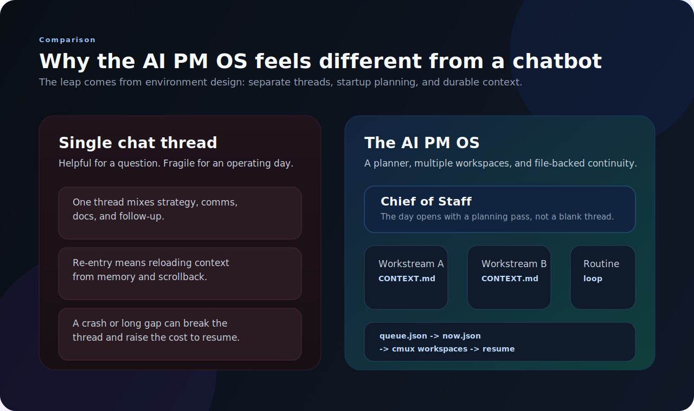

# Why the AI PM OS Feels More Powerful Than a Chatbot

## TL;DR

The AI PM OS feels more powerful than a chatbot because it is not just a conversation. It is an environment: durable workstreams, a startup routine, explicit next actions, and multiple focused sessions that can resume from files instead of memory. The power comes from orchestration and continuity, not just model quality.

## Context

Whenever people try one of these systems, they often assume the magic must be the model.

But that has not been my experience.

The biggest jump in usefulness did not come from a better prompt or a smarter LLM. It came from changing the shape of the work around the model.

Once I stopped treating the agent like a chatbot and started treating it like part of my operating environment, the whole thing got much more capable.

## Chat is a weak container for ongoing work

Chat is great for a question.

It is much worse for:

- a week-long project
- a decision with multiple stakeholders
- a thread you have to pause and resume repeatedly
- a workday that mixes planning, meetings, writing, and follow-up

That is not a knock on chat. It is just the wrong container for durable operational state.

If all context lives inside the conversation, then every interruption is expensive.

*The difference is not just a better model. It is a better container for ongoing work.*

## The feeling of power comes from four things

### 1. Durable context

Each workstream in the AI PM OS has its own `CONTEXT.md`. That means the important state is written down in a place the next session can read.

This changes the user's relationship with the system. You stop feeling like you have to keep everything alive in one thread.

### 2. Separation of threads

A single chat window tends to flatten everything into one stream.

Real work is not like that. Strategy work, a legal review, meeting prep, and a product spec are different modes. They benefit from different prompts, different files, and different scopes.

Parallel `cmux` workspaces make that separation explicit.

### 3. A default startup path

One of the hardest parts of knowledge work is not execution. It is deciding what to do first.

The Chief of Staff flow helps because it begins each day by reviewing context and choosing what deserves attention. That reduces thrash. The agent is not just waiting for instructions. It is helping shape the opening move.

### 4. File-backed continuity beats vibe-based memory

A lot of AI UX still relies on "trust the model to remember enough." That works until it doesn't.

File-backed continuity is boring in the best way. You can inspect it, edit it, diff it, and clean it up. When the system feels dependable, it is usually because the important state has a durable home.

## Why this matters for PM work in particular

Product management has a weird shape.

You are juggling strategy, delivery, comms, research, stakeholder management, docs, and a dozen follow-ups that all move at different speeds. The work is not linear. It is a queue of partially advanced threads.

That is exactly why an operating-system model fits better than a chatbot model.

An operating system can:

- keep threads separate
- rank what matters now
- preserve continuity between sessions
- support recurring routines as well as one-off projects

A chatbot mostly waits for the next prompt.

## The model still matters, just less than people think

None of this means the LLM is irrelevant. Better reasoning helps. Better writing helps. Better tool use helps.

But once the model crosses a reasonable competence threshold, the bigger wins come from system design.

In other words: after a point, the product matters more than the raw intelligence.

## What I learned

**Environment design is a force multiplier.** The same model feels dramatically smarter when it has the right structure around it.

**The best AI workflows reduce re-entry cost.** If coming back to work is easy, the system becomes part of your day instead of a novelty.

**Reliability often looks unglamorous.** Short context files, queue rankings, and launcher scripts are not flashy, but they create trust.

**This is closer to software than chat.** The moment you feel that shift, you start designing the agent differently.

---

*Related: [I Built an AI PM OS](./2026-04-12-ai-pm-os.md) and [How the AI PM OS Spins Up My Entire Workday](./2026-04-12-how-ai-pm-os-works.md).*

*[← Back to all thoughts](../thoughts/README.md) · [🧠 synthetic-mind](../README.md)*
